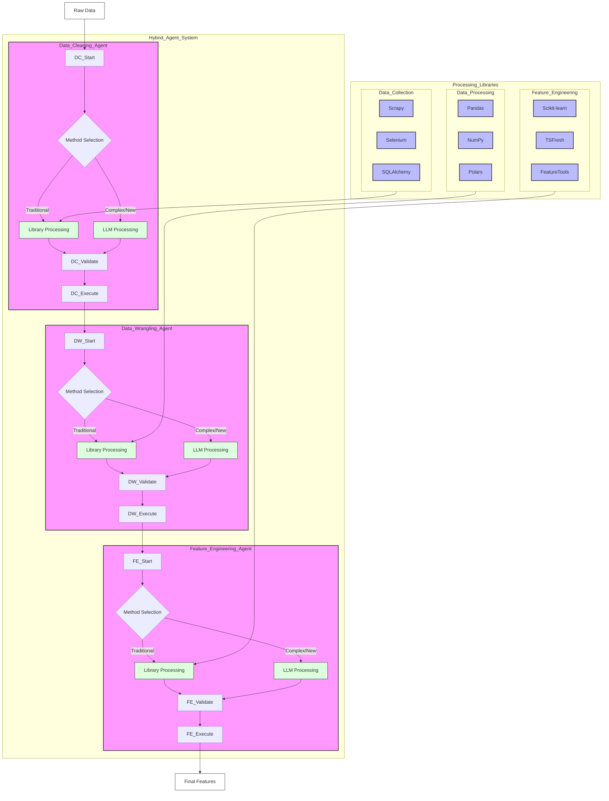

## A revised system flowchart design:

Key improvements in this design:

1. Added Orchestration Layer:
- Monitoring system
- Centralized caching
- Testing framework

2. Model Layer with Fallback:
- External LLM API integration
- Local LLM backup
- Automatic fallback logic

3. Validation Layer:
- Code validation before execution
- Data validation between agents
- Performance monitoring

4. Enhanced Agent Framework:
- Cache checking before model calls
- Standardized validation integration
- Error handling with fallbacks

5. System Monitoring:
- Performance tracking
- API usage monitoring
- Cache hit/miss tracking