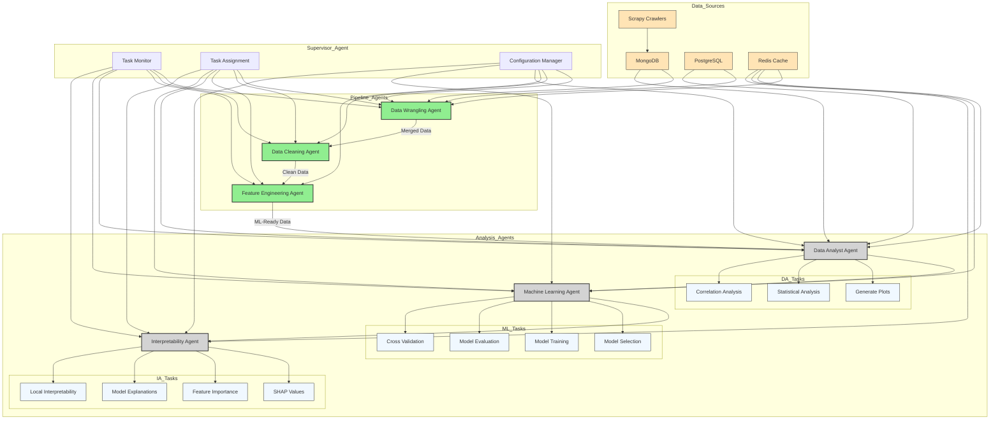

## A proposed enhanced flowchart for completing the AI Data Science Team system:

Key enhancements:

1. Data Infrastructure:
- Integration of Scrapy crawlers for data collection
- MongoDB for unstructured data storage
- PostgreSQL for structured data
- Redis for caching and performance

2. Supervisor Agent:
- Task monitoring
- Dynamic task assignment
- Configuration management

3. Analysis Agents Tasks:
- Data Analyst: Statistical analysis, plotting, correlation studies
- ML Agent: Model selection, training, evaluation
- Interpretability Agent: SHAP values, feature importance, model explanations

4. System Integration:
- Pipeline agents handle ETL processes
- Analysis agents focus on insights and modeling
- Supervisor coordinates all activities

Added:
1. Cache connections to analysis agents
2. Direct database access for Data Analyst
3. Cross validation in ML tasks
4. Local interpretability for IA
5. Clear data flow between components
6. Style classes for better visualization