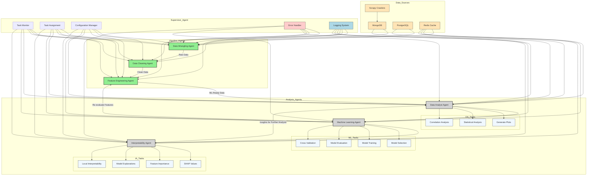

## AI-powered data science team new comment:

The flowchart is well-structured and effectively communicates the workflow of your AI-powered data science team. However, there are a few areas where you could make improvements or additions to enhance clarity and completeness:

### 1. **Clarify Data Flow Between Agents**
   - **Data Wrangling Agent (DW) to Data Cleaning Agent (DC):** It’s clear that the data flows from DW to DC, but you might want to specify the type of data being passed (e.g., raw data, merged data).
   - **Data Cleaning Agent (DC) to Feature Engineering Agent (FE):** Similarly, specify that the data is now clean and ready for feature engineering.
   - **Feature Engineering Agent (FE) to Data Analyst Agent (DA):** Indicate that the data is now ML-ready.

### 2. **Add Feedback Loops**
   - **Model Evaluation to Feature Engineering:** In real-world scenarios, model evaluation might lead to revisiting feature engineering. Consider adding a feedback loop from the Machine Learning Agent (ML) back to the Feature Engineering Agent (FE).
   - **Interpretability Agent to Data Analyst:** The Interpretability Agent (IA) might provide insights that could lead to further data analysis. A feedback loop from IA to DA could be useful.

### 3. **Task Dependencies**
   - **Supervisor Agent (SA) to Tasks:** While the Supervisor Agent monitors, assigns, and configures tasks, it might be helpful to show dependencies or sequences of tasks more explicitly. For example, certain tasks in the Machine Learning Agent (ML) might depend on the completion of tasks in the Data Analyst Agent (DA).

### 4. **Error Handling and Logging**
   - **Error Handling:** Consider adding an error handling mechanism or logging system that the Supervisor Agent can monitor. This could be represented as a separate node or subgraph.
   - **Logging:** You might want to add a logging system that captures the activities of each agent, which could be useful for debugging and auditing.

### 5. **Cache Usage**
   - **Redis Cache:** While Redis is connected to DA, ML, and IA, you might want to specify what kind of data is being cached (e.g., intermediate results, model parameters).

### 6. **Data Storage**
   - **PostgreSQL and MongoDB:** It’s clear that these are used for data storage, but you might want to specify what kind of data is stored in each (e.g., raw data in MongoDB, processed data in PostgreSQL).

### 7. **Agent Status**
   - **Agent Status Indicators:** The use of `complete` and `inprogress` classes is a good start, but you might want to add more status indicators (e.g., `pending`, `failed`) to provide a more comprehensive view of the system’s state.

### 8. **Future Agents**
   - **Placeholder for Future Agents:** Since you have agents that are coming soon (Data Analyst, Machine Learning Agent, Interpretability Agent, Supervisor), you might want to add placeholders or greyed-out nodes to indicate where these will fit into the workflow.

### 9. **Tech Stack Integration**
   - **Tech Stack Details:** While the tech stack is mentioned in the description, you might want to add brief annotations or a legend to indicate which parts of the flowchart correspond to which technologies (e.g., Scrapy for crawling, Redis for caching).

### 10. **Legend and Annotations**
   - **Legend:** Add a legend to explain the different classes (e.g., `complete`, `inprogress`, `storage`, `tasks`).
   - **Annotations:** Consider adding brief annotations to explain complex flows or decisions within the flowchart.

### Example of Updated Mermaid Code with Some of the Suggestions:

### Conclusion
The flowchart is already quite comprehensive, but these suggestions can make it even more detailed and clear, especially for stakeholders who may not be familiar with the technical intricacies.