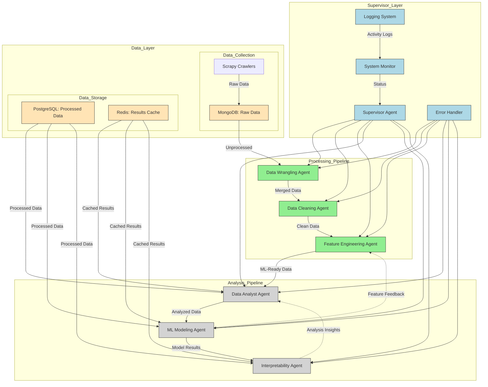

## An improved version focusing on key enhancements:

Key improvements:
1. Added hierarchical layer structure
2. Included error handling and logging
3. Clarified data flow types
4. Added feedback loops
5. Specified storage purposes
6. Improved monitoring system
7. Clear status indicators
8. Simplified visual organization

This design balances complexity and clarity while maintaining all essential functionalities.